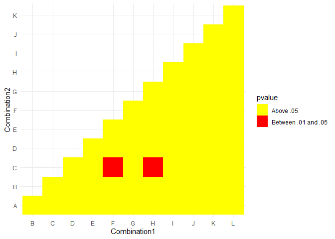
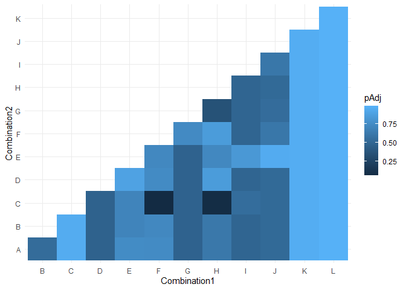

Script
================

There are six replicates in the original Excel dataset. The first
portion of the program takes the six replicates in the Excel file. It
bind them together.

It then creates a dataset with all of the unique combination from A to
L.

This leaves us with 132 rows, or 144 - 12. There are 12 rows which are
the diagonal products.

Finally, we make two comparisons:

1.  We use a t-test to compare the actual values (the diagonal elements)
    to the predicted values (the products of different elements) and
    determine whether we can reject the null that there is no difference
    between the diagonal products and the actual value.
2.  We use a t-test to again compare the actual and predicted values.
    However, to determine whether we can reject the null, we adjust the
    p-value. We use the Benjamini & Hochberg (1995) adjustment.

The first method provides the un-adjusted t-tests.

<!-- -->

The second heat map shows the categorized p-values. The two categories
are below .05, and above .05.

<!-- -->

The second method uses the correct adjustment, an independent t-test
method. We use the `R` function `p.adjust`. This is the appropriate
adjustment based on prior literature. This is much less powerful, and
yields no combinations with a p-value of below .05.

<!-- -->

<!-- -->

The two csvs with pvalue and combinations can be found in the Output
folder.

1.  Method1.csv - corresponds to the first heat map.
2.  Method2.csv - corresponds to the second heat map.
